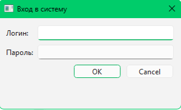
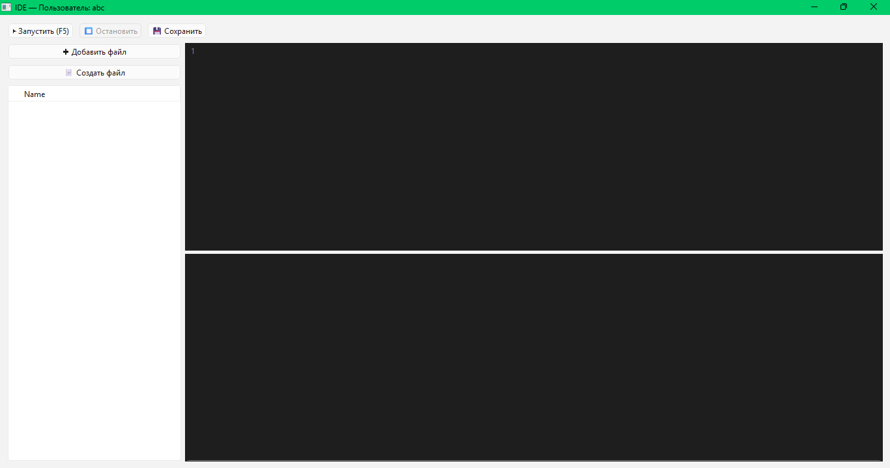
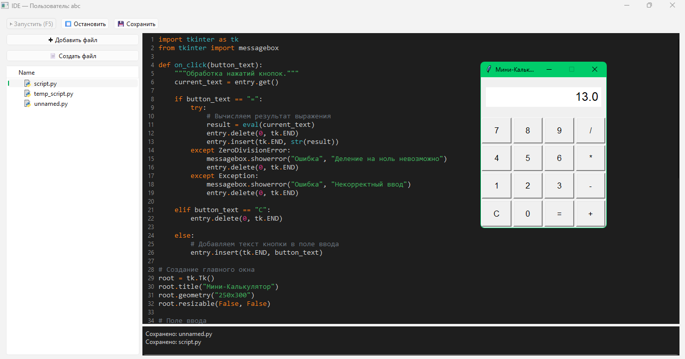
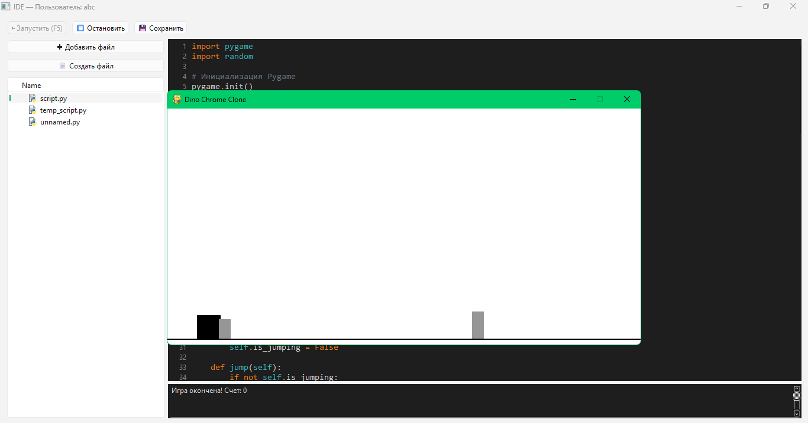
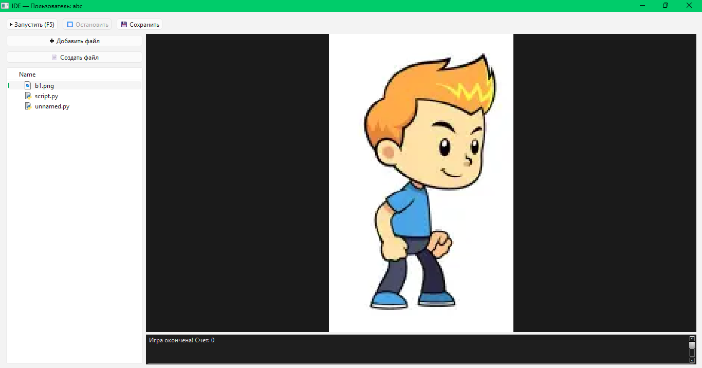

# 🖥️ MiniIDE

> 🇰🇿 [Қазақша](#қазақша) | 🇷🇺 [Русский](#русский) | 🇬🇧 [English](#english)

## ⬇️ Скачать / Жүктеу / Download

[](https://drive.google.com/file/d/1fqYYHSeln0vuOwAM2HuHBh0AGEJNsEun/view?usp=sharing)

> Windows 10/11 · Установка не требуется · ~74 MB

---

## Қазақша

### MiniIDE — мектептерге арналған Python оқу ортасы

**MiniIDE** — мектеп сыныбы үшін арнайы жасалған портативті Python даму ортасы. Оқушылар мен мұғалімдер Python немесе Pygame-ді **қолмен орнатпайды** — бәрі дайын, тек іске қосу жеткілікті.

### 🎯 Неге жасалды?

Мектеп сыныбында Python орнату — үлкен мәселе: әр компьютерге бөлек орнату, нұсқалар сәйкеспеуі, Pygame конфигурациясы, сабақ уақытының жоғалуы. **MiniIDE** осы мәселені толығымен шешеді:

- 📦 **Портативті Python** — `python_env/` қалтасында дайын, орнатуды қажет етпейді
- 🎮 **Pygame алдын ала орнатылған** — оқушы бірден ойын жазуды бастай алады
- 🔐 **Авторизация жүйесі** — әр оқушының жеке аккаунты, бір компьютерде бірнеше оқушы кезекпен жұмыс жасай алады
- 🙈 **Оқушылар бір-бірінің жұмысын көрмейді** — файлдар шифрланған, тек өз аккаунтымен ашылады, көшіру мүмкін емес
- 💾 **EXE-файл ретінде жинақталған** — PyInstaller арқылы, ешқандай орнату қажет емес
- 👩‍🏫 **Мұғалім үшін ыңғайлы** — USB-флешкадан іске қосылады, баптаусыз жұмыс жасайды

### ✨ Мүмкіндіктер

- ▶️ Кодты тікелей IDE ішінде іске қосу (портативті Python арқылы)
- 📝 Python синтаксисін бөлектейтін код редакторы
- 🗂️ Жеке файлдар ағашы (әр оқушының өз жеке қалтасы)
- 🖼️ Суреттерді қарау (PNG, JPG, GIF)
- 🎵 Аудио файлдарды ойнату (MP3, WAV)
- 💾 Файлдарды шифрлап сақтау (XOR)
- ⌨️ F5 — іске қосу, Ctrl+S — сақтау

## 📸 Скриншоттар


*Кіру және тіркелгі жасау терезесі. Әр оқушы өз логинімен кіреді — деректер шифрланады.*


*MiniIDE басты терезесі. Сол жақта файл ағашы, ортада код редакторы, төменде нәтиже шығатын консоль.*


*tkinter кітапханасымен жазылған графикалық терезені іске қосу мысалы.*


*Pygame арқылы ойын кодын іске қосу. Портативті ортада дұрыс жұмыс істейді.*


*MiniIDE ішінен PNG, JPG, GIF суреттерін ашу және қарау мүмкіндігі.*

### 🚀 Орнату және іске қосу

**1. Дайындық**
- Архивті жүктеп алып, қалыпты қалтаға шығарыңыз
- Қалта жолында кириллица болмауы керек: `C:\Tools\MiniIDE` ✅

**2. Қалта құрылымы**
```
MiniIDE/
├── MyMiniIDE.exe    ← негізгі файл
├── python_env/      ← портативті Python + Pygame
├── students/        ← оқушылардың жеке қалталары (автоматты жасалады)
└── _internal/       ← қызметтік компоненттер
```

**3. Бірінші іске қосу**
- `MyMiniIDE.exe` файлын іске қосыңыз
- Логин мен құпия сөзіңізді енгізіңіз
- Бірінші кіру кезінде аккаунт автоматты түрде жасалады — деректерді есте сақтаңыз!

**⚠️ Ақаулықтарды жою**

| Мәселе | Шешім |
|--------|-------|
| Консоль бос | `python_env/` қалтасы `MyMiniIDE.exe` қасында тұруы керек |
| Бағдарлама ашылмайды | Әкімші ретінде іске қосыңыз |
| Антивирус бұғаттайды | Ерекшеліктерге қосыңыз (PyInstaller қолданбаларына жалған оң нәтиже) |

### 🛠️ Технологиялар

`Python` `PyQt6` `Pygame` `PyInstaller` `QProcess` `XOR Encryption`

## 🏗️ Жоба архитектурасы

- **GUI:** PyQt6 негізіндегі desktop интерфейс  
- **Code Execution:** QProcess арқылы оқшауланған код орындау  
- **Python Runtime:** `python_env/` ішінде портативті интерпретатор  
- **Storage:** Әр қолданушы үшін жеке, шифрланған қалталар  
- **Packaging:** PyInstaller арқылы EXE жинақтау  

## ⚠️ Шектеулері

- Windows-пен ғана жұмыс істейді (PyInstaller build)  
- Толық sandbox емес (QProcess арқылы базалық оқшаулау)  
- `python_env/` репозиторийде жоқ (көлеміне байланысты)  

## 🤔 Неге VS Code емес?

MiniIDE келесі жағдайлар үшін жасалған:

- Орнатуға рұқсат жоқ  
- Интернет шектеулі  
- Бір компьютерде бірнеше оқушы жұмыс істейді  

VS Code — қуатты құрал, бірақ орнатуды және баптауды талап етеді.  
MiniIDE — бірден іске қосылады, ешқандай дайындықсыз.

## 🚧 Болашақ жоспарлар (Roadmap)

- [ ] Linux жүйесін қолдау
- [ ] Қауіпсіз орындалу ортасын жақсарту (sandbox)
- [ ] Оқушы жобаларын бұлт арқылы сақтау
- [ ] Мұғалімге арналған басқару панелі
---

## Русский

### MiniIDE — учебная Python-среда для школьного класса

**MiniIDE** — портативная среда разработки, созданная специально для школьного урока программирования. Главная идея: **ни ученик, ни учитель ничего не устанавливают** — Python и Pygame уже включены, достаточно просто запустить программу.

### 🎯 Зачем это создано?

В школьном классе установка Python — настоящая головная боль: разные версии на разных компьютерах, проблемы с Pygame, потеря времени урока. MiniIDE решает это полностью:

- 📦 **Портативный Python** в папке `python_env/` — просто скопируй и запускай
- 🎮 **Pygame предустановлен** — ученик сразу пишет игры без дополнительных настроек
- 🔐 **Система авторизации** — у каждого ученика свой логин, несколько учеников работают на одном компьютере в разное время
- 🙈 **Ученики не видят работы друг друга** — файлы зашифрованы, открываются только под своим аккаунтом, списывание исключено
- 💾 **Скомпилирован в EXE** через PyInstaller — установка не нужна
- 👩‍🏫 **Запускается с флешки** — принёс, запустил, работаешь

### ✨ Возможности

- ▶️ Запуск кода прямо в IDE через встроенный портативный Python
- 📝 Редактор кода с подсветкой синтаксиса Python
- 🗂️ Личная папка для каждого ученика (изолированные директории)
- 🖼️ Просмотр изображений (PNG, JPG, GIF)
- 🎵 Воспроизведение аудио (MP3, WAV)
- 💾 Шифрованное сохранение файлов (XOR по логину)
- ⌨️ Горячие клавиши: F5 — запуск, Ctrl+S — сохранение

## 📸 Скриншоты


*Окно входа и создания аккаунта. Каждый ученик входит под своим логином — данные шифруются.*


*Главное окно MiniIDE. Слева — дерево файлов, в центре — редактор кода, внизу — консоль вывода.*


*Пример запуска графического окна на библиотеке tkinter.*


*Запуск игрового кода на Pygame. Работает в портативной среде без установки.*


*Открытие и просмотр изображений (PNG, JPG, GIF) прямо в MiniIDE.*

### 🚀 Установка и запуск

**1. Подготовка**
- Скачайте архив и **извлеките** все файлы в обычную папку
- В пути не должно быть кириллицы: `C:\Tools\MiniIDE` ✅, `C:\Рабочий стол\` ❌

**2. Структура папок**
```
MiniIDE/
├── MyMiniIDE.exe    ← запускать этот файл
├── python_env/      ← портативный Python + Pygame
├── students/        ← личные папки учеников (создаётся автоматически)
└── _internal/       ← служебные компоненты (не трогать)
```

> 💡 Для удобства: правая кнопка на `MyMiniIDE.exe` → «Отправить» → «Рабочий стол (создать ярлык)»

**3. Первый запуск**
- Запустите `MyMiniIDE.exe`
- Введите логин и пароль — при первом входе аккаунт создаётся автоматически
- Запомните данные для следующих входов!

**4. Работа в редакторе**
- «📄 Создать файл» или «✚ Добавить файл» — создание/загрузка файлов
- **F5** или «▶ Запустить» — запуск кода
- Результат и ошибки — в нижней консоли
- Файлы зашифрованы и защищены от чтения через блокнот

**⚠️ Устранение неполадок**

| Проблема | Решение |
|----------|---------|
| Консоль пустая при запуске | Убедитесь, что `python_env/` лежит рядом с `MyMiniIDE.exe` |
| Программа не открывается | Запустите от имени администратора |
| Антивирус блокирует | Добавьте в исключения (ложное срабатывание на PyInstaller) |

### 📁 Структура исходного кода

```
MiniIDE/
├── main.py            # Основное приложение (IDE, авторизация, UI)
├── EditorPQT.py       # Редактор кода с подсветкой синтаксиса
├── icon.ico           # Иконка приложения
├── python_env/        # Портативный Python + Pygame (не в репозитории)
└── students/          # Создаётся автоматически при первом запуске
```

> ⚠️ Папка `python_env/` не загружена в репозиторий из-за размера — скачайте готовый архив по кнопке выше.

### 🛠️ Стек технологий

`Python` `PyQt6` `Pygame` `PyInstaller` `QProcess` `QFileSystemModel` `XOR Encryption`

### 🏗️ Архитектура проекта

- **GUI**: PyQt6 — десктопный интерфейс с файловым деревом и редактором кода
- **Запуск кода**: изолированный вызов через QProcess (не блокирует интерфейс)
- **Python Runtime**: встроенный портативный интерпретатор из папки `python_env/`
- **Хранение данных**: локальные папки учеников с XOR-шифрованием (по логину)
- **Сборка**: PyInstaller — единый EXE-файл для распространения

## ⚠️ Известные ограничения

- **Только Windows** — сборка под PyInstaller, Linux/macOS не поддерживаются
- **Базовая изоляция процессов** — не является полноценной песочницей (ученик с опытом может выйти за пределы)
- **python_env/ не в репозитории** — из-за размера, скачивается отдельно (см. кнопку выше)
- **XOR — обфускация, не шифрование** — см. примечание в разделе технологий

### 🤔 Почему не VS Code?

VS Code — мощный инструмент, но в школьном классе он требует:
- Установки на каждый компьютер
- Прав администратора
- Настройки Python окружения
- Интернета для расширений

**MiniIDE** создан для ограниченных условий:
- Компьютеры без прав администратора
- Медленный или отсутствующий интернет
- Один компьютер на несколько учеников в разное время

MiniIDE не заменяет VS Code. Он решает задачу, которую VS Code не решает — **zero-setup программирование в школьном классе**.

## 🚧 Планы развития (Roadmap)

- [ ] **Linux support** — упаковка в AppImage
- [ ] **Настоящая песочница** — ограничение доступа к файловой системе
- [ ] **Cloud sync** — чтобы ученик мог продолжить дома
- [ ] **Дашборд учителя** — просмотр работ всех учеников
- [ ] **Поддержка MicroPython** — для уроков с микроконтроллерами

### 💡 Применение в классе

Разработано и активно используется на уроках информатики в **PhysTech School Almaty**. Учитель один раз настраивает папку — ученики запускают `MyMiniIDE.exe`, вводят логин и начинают писать код. Никакой установки, никакого списывания, никакой потери времени урока.

### 👨‍💻 Автор

**Ержан Базаргали** — учитель информатики, PhysTech School Almaty
📧 eginsu86@gmail.com | [LinkedIn](https://linkedin.com/in/ebazargali) | [GitHub](https://github.com/YerzhanBazargali)

---

## English

### MiniIDE — Zero-Setup Python IDE for School Classrooms

**MiniIDE** is a portable, classroom-ready Python development environment. The core idea: **students and teachers install nothing**. Python and Pygame are bundled inside — copy the folder to any Windows PC and it works immediately.

### 🎯 Why it was built

Installing Python in a school computer lab is a recurring problem: version mismatches, missing Pygame, wasted lesson time, IT department dependency. MiniIDE solves all of it:

- 📦 **Portable Python bundled** in `python_env/` — no system installation, works on any Windows PC
- 🎮 **Pygame pre-installed** — students write games from day one, zero extra setup
- 🔐 **Per-student login system** — each student has their own encrypted account; multiple students share one computer across sessions without conflict
- 🙈 **Students cannot see each other's work** — files are encrypted per login (XOR keyed by username), copying between students is impossible
- 💾 **Compiled to EXE** via PyInstaller — just double-click and run
- 👩‍🏫 **Runs from a USB drive** — bring it to any classroom, plug in and teach

### ✨ Features

- ▶️ Run Python code inside the IDE via bundled portable Python (QProcess)
- 📝 Code editor with Python syntax highlighting
- 🗂️ Isolated personal file tree per student
- 🖼️ Image viewer (PNG, JPG, GIF)
- 🎵 Audio playback (MP3, WAV)
- 💾 Encrypted file storage (XOR keyed by username)
- ⌨️ Keyboard shortcuts: F5 to run, Ctrl+S to save

## 📸 Screenshots


*Login and account creation window. Each student logs in with their own credentials — data is encrypted.*


*MiniIDE main window. Left: file tree, center: code editor, bottom: output console.*


*Example of running a graphical window using the tkinter library.*


*Running game code with Pygame. Works in a portable environment with no installation required.*


*Opening and viewing images (PNG, JPG, GIF) directly inside MiniIDE.*

### 🚀 Installation & Setup

**1. Preparation**
- Download the archive and **extract all files** to a regular folder
- Avoid Cyrillic characters in the folder path: `C:\Tools\MiniIDE` ✅

**2. Folder Structure**
```
MiniIDE/
├── MyMiniIDE.exe    ← launch this file
├── python_env/      ← portable Python + Pygame
├── students/        ← per-student encrypted folders (auto-created)
└── _internal/       ← app internals (do not modify)
```

> 💡 Tip: right-click `MyMiniIDE.exe` → Send to → Desktop (create shortcut)

**3. First Launch**
- Run `MyMiniIDE.exe`
- Enter a login and password — account is created automatically on first login
- Remember your credentials for future sessions!

**4. Using the Editor**
- "📄 Create file" or "✚ Add file" — create or import files
- **F5** or "▶ Run" — execute the code
- Output and errors appear in the bottom console
- Files are encrypted and protected from reading in Notepad

**⚠️ Troubleshooting**

| Issue | Solution |
|-------|----------|
| Console is empty on run | Make sure `python_env/` is in the same folder as `MyMiniIDE.exe` |
| App won't open | Try running as Administrator |
| Antivirus blocks it | Add to exclusions (false positive — common with PyInstaller apps) |

### 📁 Source Structure

```
MiniIDE/
├── main.py            # Main app — IDE, auth, UI logic
├── EditorPQT.py       # Code editor with syntax highlighting
├── icon.ico           # Application icon
├── python_env/        # Portable Python + Pygame (not in repo — too large)
└── students/          # Auto-created on first run
```

> ⚠️ `python_env/` is excluded from the repository. Download the full ready-to-use archive using the button at the top.

### 🛠️ Tech Stack

`Python` `PyQt6` `Pygame` `PyInstaller` `QProcess` `QFileSystemModel` `XOR Encryption`

### 🏗️ Architecture

- GUI: PyQt6-based desktop interface
- Code Execution: Isolated execution via QProcess
- Python Runtime: Embedded portable interpreter (python_env)
- Storage: Per-user encrypted directories (XOR-based)
- Packaging: PyInstaller (single EXE distribution)

## ⚠️ Limitations

- Windows-only (due to PyInstaller build)
- Not a secure sandbox (process isolation is basic)
- python_env not included in repo due to size

## 🤔 Why not VS Code?

MiniIDE is designed for constrained classroom environments where:
- Installation is restricted
- Internet access is limited
- Students share computers

VS Code is powerful, but requires setup and admin access. MiniIDE works out of the box.

## 🚧 Roadmap

- [ ] Linux support
- [ ] True sandboxing (restricted execution)
- [ ] Cloud sync for student projects
- [ ] Teacher dashboard

### 💡 Real Classroom Use

Built and actively used at **PhysTech School Almaty**. The teacher sets up the folder once. Students launch `MyMiniIDE.exe`, log in, and start coding — no installation, no copying between students, no wasted class time.

### 👨‍💻 Author

**Yerzhan Bazargali** — Computer Science Teacher, PhysTech School Almaty
📧 eginsu86@gmail.com | [LinkedIn](https://linkedin.com/in/ebazargali) | [GitHub](https://github.com/YerzhanBazargali)

---

*Built for real classrooms. Solving real problems.* 🏫
